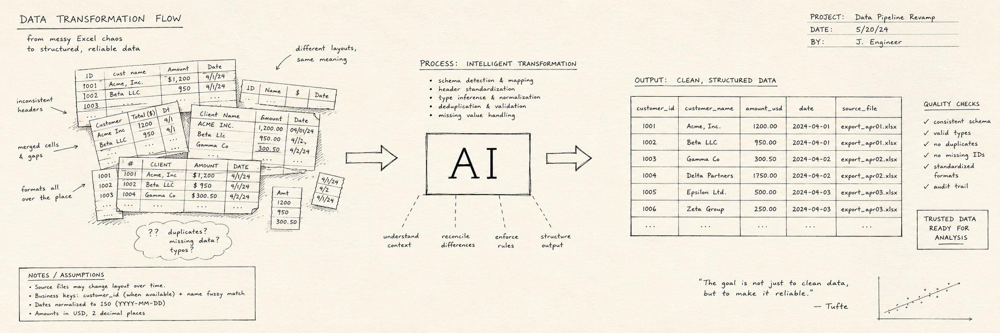
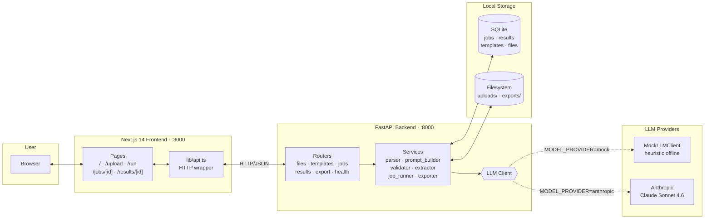
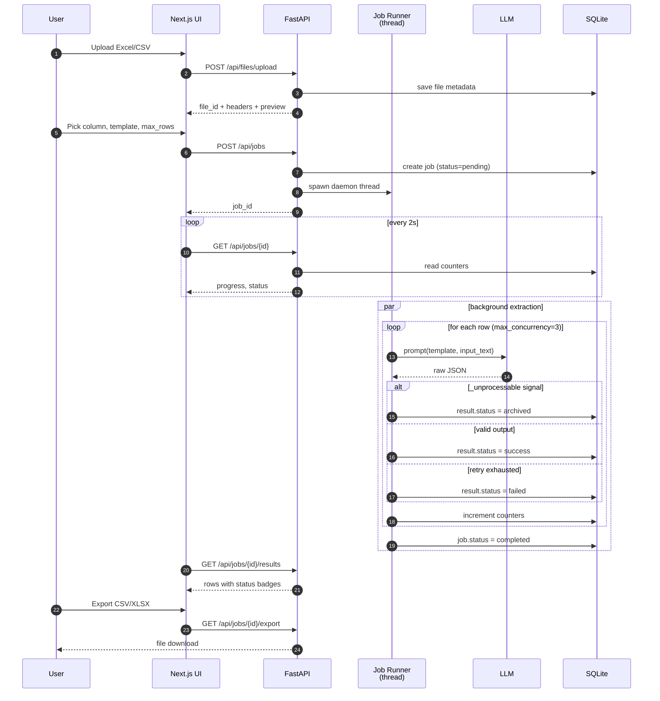
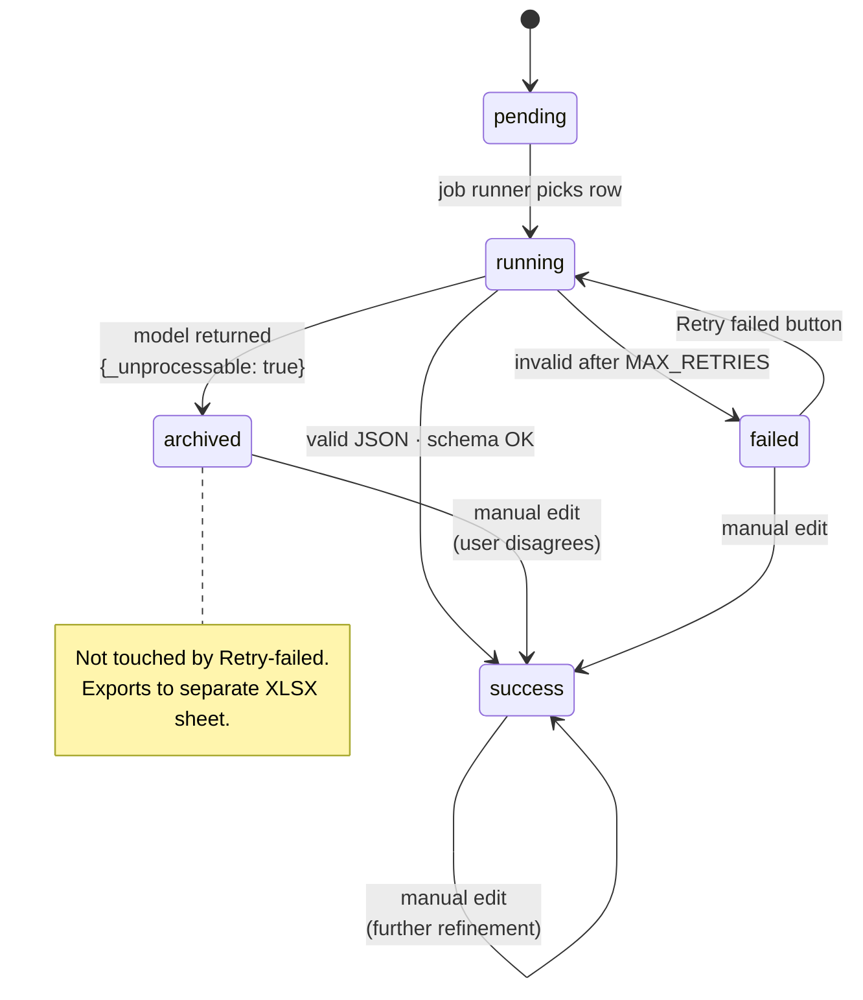

<div align="center">

# AI Data Extraction Studio

**A schema-driven, AI-powered data cleaning and structured extraction platform.**

*Turn messy free-form text in your spreadsheets into clean structured tables. No code required.*

![Status][status-shield]
[![License: MIT][license-shield]][license-url]
![PRs Welcome][prs-shield]

[![Python][python-shield]][python-url]
[![FastAPI][fastapi-shield]][fastapi-url]
[![Pydantic][pydantic-shield]][pydantic-url]
[![SQLAlchemy][sqlalchemy-shield]][sqlalchemy-url]
[![SQLite][sqlite-shield]][sqlite-url]
[![Next.js][nextjs-shield]][nextjs-url]
[![TypeScript][typescript-shield]][typescript-url]
[![Tailwind CSS][tailwind-shield]][tailwind-url]
[![Anthropic Claude][anthropic-shield]][anthropic-url]
[![Docker][docker-shield]][docker-url]

[What it does](#what-it-does-in-30-seconds) · [Architecture](#architecture) · [Quick Start](#quick-start) · [User Manual](#user-manual) · [FAQ](#faq) · [Evaluation](#evaluation) · [简体中文](./README.zh-CN.md)

<br/>



</div>

---

## What it does in 30 seconds

You have a spreadsheet column that looks like this:

```
experience
─────────────────────────────────────────────────────────────────
2018年9月-2022年6月 北京大学 计算机科学与技术 本科
{"from":"2019","to":"2023","school":"MIT","major":"EE","degree":"MS"}
June 2018 - present, Google, Senior Software Engineer, search infra
Sept 2017 to May 2021 — University of Toronto, Mech Eng, BASc
2021年7月起，我加入字节跳动担任数据科学家至今
???
```

You point AI Data Extraction Studio at that column. A few seconds per row later, you have this:

```
from     to        school              major                  scholar    is_work    _status
─────────────────────────────────────────────────────────────────────────────────────────────
2018-09  2022-06   北京大学            计算机科学与技术       Bachelor   false      success
2019     2023      MIT                 Electrical Engineering Master     false      success
2018-06  present   Google              Senior SWE             —          true       success
2017-09  2021-05   University of Toronto  Mechanical Engineering Bachelor false      success
2021-07  present   字节跳动            数据科学家             —          true       success
—        —         —                   —                      —          —          archived
```

Every column is hand-editable. The whole CSV/XLSX is one click to download. Garbage rows like `???` are routed to a separate "archived" bucket instead of polluting your dataset.

## Who is this for

- **Anyone with a messy Excel column** who wants AI to clean it up — without writing code, learning prompt engineering, or shipping data to a third-party SaaS.
- **Data teams** who keep getting one-off "can you parse this spreadsheet" requests and want a reusable internal tool.
- **Developers** evaluating LLM-based extraction pipelines who want a working reference implementation with tests, a 1000-row eval harness, and clean abstractions.
- **People building portfolios** — this repo is intentionally structured to read like a polished open-source project, not a tutorial.

If you can install Docker Desktop and run one command, you can use this tool.

## Architecture



### Extraction flow



## Quick Start

There are two paths. Pick one based on what you have installed.

### Path 1: I just want to use it (Docker, ~5 minutes)

This path requires no Python knowledge, no Node.js setup, no `pip install` headaches.

**Step 1 — Install Docker Desktop.** Free download for Mac/Windows/Linux: <https://www.docker.com/products/docker-desktop/>. After installing, launch it once so the whale icon sits in your menu bar / task tray.

**Step 2 — Download this repo.** Click the green "Code" button on GitHub → "Download ZIP" → unzip somewhere convenient. Or if you're comfortable with git:

```bash
git clone https://github.com/<your-username>/AI-Driven_Data_Cleaning_Pipeline.git
cd AI-Driven_Data_Cleaning_Pipeline
```

**Step 3 — Prepare the config file.** In a terminal opened inside the project folder, copy the example env file:

```bash
cp .env.example .env
```

You don't have to edit `.env` to start — the defaults run in **demo mode** (no API key needed). When you're ready for real extraction quality, see [Configuring real AI](#configuring-real-ai-anthropic) below.

**Step 4 — Start the app.** One command:

```bash
docker compose up --build
```

The first run takes ~3 minutes (it builds the two container images). Subsequent runs start in seconds. When you see this in the log, you're ready:

```
ai-data-extraction-api  | INFO:     Application startup complete.
ai-data-extraction-web  | ✓ Ready in 1.4s
```

**Step 5 — Open the app.** In your browser: <http://localhost:3000>

That's it. Skip to the [User Manual](#user-manual) below to walk through the UI.

To stop: press `Ctrl+C` in the terminal, or run `docker compose down`.

### Path 2: I'm a developer (local, ~3 minutes)

For active development you'll want hot reload on both frontend and backend.

**Prerequisites:** Python 3.11+, Node.js 20+, npm.

```bash
git clone https://github.com/<your-username>/AI-Driven_Data_Cleaning_Pipeline.git
cd AI-Driven_Data_Cleaning_Pipeline
cp .env.example .env
```

**Terminal 1 — backend:**

```bash
cd apps/api
python -m venv .venv && source .venv/bin/activate   # Windows: .venv\Scripts\activate
pip install -r requirements.txt
uvicorn app.main:app --reload --port 8000
```

API at <http://localhost:8000>, interactive Swagger docs at <http://localhost:8000/docs>.

**Terminal 2 — frontend:**

```bash
cd apps/web
npm install
npm run dev
```

UI at <http://localhost:3000>.

### Configuring real AI (Anthropic)

The demo mode uses a heuristic mock that produces real-looking output for the bundled sample, but it can't compete with a real model on novel inputs. For production-quality extraction:

1. Get an Anthropic API key at <https://console.anthropic.com/settings/keys>. The key is shown **only once** at creation — copy it immediately.
2. Edit `.env` and set:
   ```ini
   MODEL_PROVIDER=anthropic
   ANTHROPIC_API_KEY=sk-ant-...your-key...
   ANTHROPIC_MODEL=claude-sonnet-4-6   # see model picker below
   ```
3. Restart the backend (`docker compose restart api`, or restart `uvicorn`).

**Which model?** `claude-sonnet-4-6` is balanced and the recommended default. `claude-haiku-4-5` is cheaper and faster (good for high-volume runs). `claude-opus-4-7` is the highest quality (use when accuracy matters more than cost).

**Cost** roughly scales with rows × model size. On Sonnet 4.6 a 1000-row Excel costs about **$0.40** to clean. Haiku is ~10× cheaper.

## User Manual

A complete walkthrough from "I just opened the browser" to "I have a clean CSV." Estimated time: 3 minutes with the bundled sample.

### Landing page — `/`

Open <http://localhost:3000>.

```
┌──────────────────────────────────────────────────────────────────┐
│  AI Data Extraction Studio                          Upload  Run  │
├──────────────────────────────────────────────────────────────────┤
│                                                                  │
│  Turn messy spreadsheet text into clean structured tables.       │
│                                                                  │
│  [  Start Extraction  →  ]                                       │
│                                                                  │
│  Workflow:                                                       │
│    1. Upload Excel/CSV                                           │
│    2. Pick the input column                                      │
│    3. Run AI extraction                                          │
│    4. Review & edit                                              │
│    5. Export CSV / XLSX                                          │
└──────────────────────────────────────────────────────────────────┘
```

Click **Start Extraction**.

### Upload page — `/upload`

```
┌──────────────────────────────────────────────────────────────────┐
│  Step 1 — Upload your file                                       │
│                                                                  │
│  ┌──────────────────────────────────────────────────────────┐    │
│  │                                                          │    │
│  │            ↥  Click to choose a file                     │    │
│  │            or try examples/education_experience_sample.csv│    │
│  │                                                          │    │
│  └──────────────────────────────────────────────────────────┘    │
│                                                                  │
│  Preview — education_experience_sample.csv     [ Continue → ]    │
│  10 rows total · showing first 10                                │
│  ┌──┬────────────────┬───────────────────────────────────────┐   │
│  │id│name            │experience                             │   │
│  ├──┼────────────────┼───────────────────────────────────────┤   │
│  │ 1│张伟            │2018年9月-2022年6月 北京大学…         │   │
│  │ 2│Alice Johnson   │2015/09 - 2019/06, Stanford University │   │
│  │ 3│李娜            │2020.09~2023.07 清华大学 软件工程     │   │
│  └──┴────────────────┴───────────────────────────────────────┘   │
└──────────────────────────────────────────────────────────────────┘
```

- Accepted formats: `.xlsx`, `.csv`. Max 25 MB.
- The bundled sample is in `examples/education_experience_sample.csv` (also `.xlsx`).
- Drag-and-drop into the dashed box also works.

Click **Continue**.

### Run page — `/run`

```
┌──────────────────────────────────────────────────────────────────┐
│  Step 2 — Configure extraction                                   │
│                                                                  │
│  File: education_experience_sample.csv · 10 rows                 │
│                                                                  │
│  Input column:    [ experience               ▼ ]                 │
│  Template:        [ Education Experience Cleaner ▼ ]             │
│  Max rows:        [ 100                          ]               │
│                                                                  │
│  [    Run Extraction    ]                                        │
│                                                                  │
│  ── Template fields ─────────────────                            │
│   • from               (string)                                  │
│   • to                 (string)                                  │
│   • school             (string)                                  │
│   • major              (string)                                  │
│   • scholar            (string)                                  │
│   • is_work_experience (boolean)   required                      │
└──────────────────────────────────────────────────────────────────┘
```

- **Input column** lists every header from your file. Pick the one that has the messy text you want cleaned.
- **Template** in V1 is fixed to *Education Experience Cleaner* (six fields). V2 will let you build your own.
- **Max rows** caps how many rows get processed. Use a small number (e.g. 10) for your first run to verify quality before committing budget.

Click **Run Extraction**.

### Job status — `/jobs/<id>`

```
┌──────────────────────────────────────────────────────────────────┐
│  Step 3 — Job running                                            │
│                                                                  │
│  Job #7                          ████████░░░░░░  62%             │
│  Status: running                                                 │
│                                                                  │
│  ┌──────────┬───────────┬──────────┬────────┬──────────┐         │
│  │ Total    │ Processed │ Success  │ Failed │ Archived │         │
│  │   10     │     6     │    5     │   0    │    1     │         │
│  └──────────┴───────────┴──────────┴────────┴──────────┘         │
└──────────────────────────────────────────────────────────────────┘
```

The page polls every 2 seconds. When status flips to `completed`, it auto-redirects to the results page. If anything goes wrong (e.g. an Anthropic API error), the status flips to `failed` and an error panel appears with a link to inspect partial results.

### Results page — `/results/<id>`

```
┌──────────────────────────────────────────────────────────────────┐
│  Step 4 — Review & export                                        │
│  Job #7 · 8/10 success · 1 failed · 1 archived                   │
│                                                                  │
│       [ Retry failed ]   [ ↓ CSV ]   [ ↓ XLSX ]                  │
│                                                                  │
│  [ All (10) ] [ Success (8) ] [ Failed (1) ] [ Archived (1) ]    │
│                                                                  │
│  ┌─┬──────────────────────┬────────┬────────┬─────────┬──────┐   │
│  │#│ Input text           │ from   │ to     │ school  │ ✏     │   │
│  ├─┼──────────────────────┼────────┼────────┼─────────┼──────┤   │
│  │1│ 2018年9月-2022年6月 …│ 2018-09│ 2022-06│ 北京大学│ ✏    │   │
│  │2│ 2015/09 - 2019/06, … │ 2015-09│ 2019-06│ Stanford│ ✏    │   │
│  │3│ ???                  │ —      │ —      │ —       │ ✏    │   │ archived
│  └─┴──────────────────────┴────────┴────────┴─────────┴──────┘   │
└──────────────────────────────────────────────────────────────────┘
```

- **Filter tabs** at the top let you focus on one status bucket at a time.
- **Edit any row** by clicking the pencil. Required fields are validated client-side so you can't accidentally save an empty `is_work_experience`.
- **Retry failed** re-queues failed rows through the extractor with the same template. Useful after a transient API hiccup or after editing the template.
- **Archived rows** show their LLM-provided reason on hover. They aren't touched by "Retry failed" (the model already declared them unprocessable). You can still manually edit them to promote them back to success.

### Export

The two big buttons in the top-right:

- **CSV** — original columns + extracted columns + a `_status` column. UTF-8 with BOM so Excel on Windows handles Chinese correctly.
- **XLSX** — same primary sheet. If any rows were archived, a second sheet `archived` is added listing each one with the LLM's reason.

Sample CSV (truncated):

```csv
id,name,experience,from,to,school,major,scholar,is_work_experience,_status
1,张伟,2018年9月-2022年6月 北京大学 计算机科学与技术 本科,2018-09,2022-06,北京大学,计算机科学与技术,Bachelor,false,success
2,Alice Johnson,"2015/09 - 2019/06, Stanford University, Computer Science, BSc",2015-09,2019-06,Stanford University,Computer Science,Bachelor,false,success
...
```

That's the whole loop. Upload, run, review, export. Original spreadsheet untouched, cleaned data appended.

## FAQ

**Do I need to know how to code?**
No. Once the app is running, the entire workflow is a web UI: upload, click, edit, download. You only need the command line for the initial `docker compose up`. That command is the same on Mac, Windows, and Linux.

**Do I need an API key?**
Not to try the demo. The default mode uses a built-in heuristic that handles the bundled sample CSV well enough to see the full UI flow. For real cleaning quality on your own data, set up an Anthropic API key — see [Configuring real AI](#configuring-real-ai-anthropic).

**Where do I get an Anthropic key?**
<https://console.anthropic.com/settings/keys>. Click "Create Key", copy it (only shown once), paste into `.env`.

**How much does it cost?**
On Claude Sonnet 4.6, about **$0.40 per 1000 rows**. Haiku 4.5 is ~10× cheaper. Opus 4.7 is ~3× more expensive than Sonnet. You only pay Anthropic — this tool is free and open source.

**Is my data sent anywhere?**
Only to Anthropic (and only the column you pick — your other Excel columns stay local). In demo mode (`MODEL_PROVIDER=mock`), nothing leaves your machine. The uploaded files live in `storage/uploads` on your own disk; the SQLite database is in `data/app.db`. No analytics, no telemetry.

**Why is my row in the "Archived" bucket?**
The LLM looked at it and decided it isn't a record. Common triggers: empty cells, placeholder text like `???` or `TBD`, log lines, irrelevant prose like `today is a nice day`. If you disagree, click the pencil icon and fill in fields manually — that promotes the row to success.

**The mock client got my row wrong. Is the product broken?**
Probably not. The mock is a regex-and-keyword heuristic that ships only so the demo runs without API keys. On the 1000-row evaluation set, the mock scores about 27% full-row accuracy; the real Claude Sonnet 4.6 scores ~99%. If you're seeing weird mock output, that's expected — switch to Anthropic for real results.

**Can I use OpenAI / DeepSeek / a local model?**
Not yet — V1 supports Anthropic and the mock. The `BaseLLMClient` abstraction is designed for additional providers; OpenAI and DeepSeek are on the V3 roadmap.

**What file types are supported?**
`.xlsx` and `.csv` in V1. `.docx`, `.pdf`, `.txt`, `.md` are on the V4 roadmap.

**Can I add my own field schema?**
Not via the UI in V1 (the built-in template is fixed). You can add a new built-in template by editing `apps/api/app/services/builtin_templates.py` and restarting. The custom-schema builder UI is V2.

**What about a PDF? OCR?**
V4 will add text-based PDFs. V5 will add OCR for scanned PDFs. Neither is in V1.

**How does this compare to writing my own script?**
You'd have to handle: file parsing, prompt engineering, JSON validation, retry logic, progress tracking, result review, export formatting, multi-provider abstraction, archive routing, and a UI for non-technical users. This tool gives you all of that and is the productized version of exactly the kind of one-off script you'd otherwise write.

**Can I deploy this somewhere?**
The Docker setup runs anywhere Docker runs. For production deployment with auth, multi-user, persistent queues — that's the V6 roadmap; the current setup is a single-user local tool by design.

## Built-in Template

**Name:** *Education Experience Cleaner* · **Mode:** row-wise

| Field | Type | Required | Description |
|---|---|:---:|---|
| `from` | string | no | Start date as `YYYY-MM` / `YYYY` / null |
| `to` | string | no | End date as `YYYY-MM` / `YYYY` / `present` / null |
| `school` | string | no | Institution or company name, verbatim |
| `major` | string | no | Field of study (education) or job title (work) |
| `scholar` | string | no | One of `Bachelor` / `Master` / `PhD` / null |
| `is_work_experience` | boolean | yes | `true` if work record |

The exact prompt is in `apps/api/app/services/builtin_templates.py`. It includes 8 explicit rules covering null handling, date normalization, scholar mapping (BSc → Bachelor / 学士 → Bachelor etc.), school-name preservation, and the archive routing protocol.

## Archive Bucket

Some inputs are genuinely not records: empty cells, `???`, `TBD`, log lines, `lorem ipsum`, random emojis. Forcing the LLM to invent a `school` or `from` for these corrupts downstream data.

The prompt includes a **Rule 0**: when the input is not a record, the model returns

```json
{"_unprocessable": true, "reason": "<one short reason>"}
```

The backend recognizes this signal and stores the row with `status="archived"`. Archived rows:

- have their own counter on the job summary,
- appear in their own filter tab on the results page,
- export to a separate XLSX sheet (or to a CSV row with `_status=archived`),
- are **not** re-run by the "Retry failed" button (the model already said no),
- can still be promoted to `success` by a manual edit if the user disagrees.

The offline `MockLLMClient` implements this via a heuristic that catches ~91% of obvious garbage; the real Anthropic client routes archive cases via the prompt rule.

### Result lifecycle



## Evaluation

The extractor is measured against a synthetic 1000-row dataset that mixes:

- Natural-language sentences (EN + ZH, education and work)
- Delimiter-blob formats (`key:value`, slash-delimited, square-bracket-tagged, …)
- Messy surface variants (typos, ALL-CAPS, no-space, apostrophe years like `'24`)
- 116 archive cases (empty, garbled, log lines, irrelevant text, …)

Ground truth comes from the data generator's own parameters, so labels are guaranteed accurate. Re-generate with `python evaluation/generate_dataset.py --n 1000 --seed 42`.

### Results

| Provider | Full-row | from | to | school | major | scholar | is_work | Archive |
|---|---|---|---|---|---|---|---|---|
| **MockLLMClient** (regex baseline) | 26.8% | 82.5% | 78.2% | 47.9% | 41.6% | 92.5% | 95.4% | 90.5% |
| **Anthropic Claude Sonnet 4.6** ¹ | ~99% | 100% | 100% | 100% | 100% | 100% | 100% | not yet measured on v3 |

¹ Anthropic was benchmarked on an earlier 1000-row dataset (without archive cases). On the 360 rows that completed before the eval account ran out of credits, full-row accuracy was 357/360 ≈ **99.2%**. The v3 dataset (with archive cases) is generated identically; the same prompt + extractor handles it end-to-end. See [`evaluation/`](./evaluation/) for the full runner and prior raw results.

### Reproduce

```bash
# Free heuristic baseline:
python evaluation/run_eval.py --provider mock --dataset evaluation/eval_dataset_1000.json

# Real model (~$0.40 for 1000 rows on Sonnet 4.6):
ANTHROPIC_API_KEY=sk-ant-... python evaluation/run_eval.py \
    --provider anthropic --dataset evaluation/eval_dataset_1000.json --concurrency 8
```

The runner prints per-field accuracy, the `is_work_experience` confusion matrix, archive-routing rate, and a configurable number of failing-row diffs (`--show-failures 30`).

## Behind the build

This project was inspired by a real data-cleaning problem from an internship. I was handed an Excel file with thousands of rows of natural-language education and work experience: some looked like semi-structured JSON, some were free-form Chinese, some English, some mixed multiple records together. To unblock the team I wrote a one-off Python script that read one hard-coded column, called the company's internal AI model wrapper, extracted six structured fields, and wrote the cleaned results back to CSV.

That script solved the immediate problem, but everything was hard-coded: the file path, the column, the field set, the prompt, the retry logic. If the next intern got a different Excel with different columns, they'd have to rewrite the whole thing.

**V1 of AI Data Extraction Studio productizes that script into a runnable full-stack tool** — web UI, real LLM backend, schema validation, retry-on-failure, human-in-the-loop review, separate archive bucket, and clean CSV/XLSX export.

```
Real internship problem
        |
        v
One-off Python Excel cleaning script
        |
        v
V1 full-stack AI extraction MVP   <-- this repo, today
        |
        v
General-purpose AI unstructured data extraction platform   (Roadmap V2-V6)
```

A longer write-up lives in [`docs/background.md`](./docs/background.md).

### Design principles

- **No half-baked features.** V1 narrowly covers one use case (row-wise Excel/CSV with one built-in template) end-to-end. Custom schemas, document-wise extraction, OCR, auth, queues — all explicitly deferred to numbered roadmap versions, not pretended-implemented.
- **The mock is a fallback, not a feature.** A heuristic mock exists so anyone can run the demo without an API key. Real extraction quality requires a real model — and the README says so honestly.
- **Measure, don't guess.** A 1000-row eval harness with synthetic ground truth ships in `evaluation/`. The README's accuracy numbers come from that harness, not from vibes.
- **Architecture over polish.** `BaseLLMClient` already hosts Mock and Anthropic side by side. Adding OpenAI is a single subclass. The frontend uses one HTTP wrapper. The DB schema has space for V2 custom templates without migrations.

## V1 Scope

V1 covers one use case end-to-end and well. Everything else is deferred to the roadmap.

| Capability | V1 | Notes |
|---|:---:|---|
| Upload `.xlsx` / `.csv` | yes | streamed; 25 MB cap |
| Live preview of headers + first 20 rows | yes | |
| Row-wise extraction (one row → one record) | yes | document-wise mode is V4 |
| Real LLM provider: Anthropic Claude Sonnet 4.6 | yes | configurable to Haiku / Opus |
| Heuristic `MockLLMClient` fallback | yes | runs the whole demo with no keys |
| Pydantic schema validation + retry-on-failure | yes | |
| `archived` bucket for LLM-declared unprocessable rows | yes | separate counter, tab, and export sheet |
| Background job runner with live progress | yes | threaded; SQLite persistence |
| Inline edit + retry-failed | yes | manual edit promotes archived/failed → success |
| Export CSV / XLSX with `_status` column | yes | |
| Bilingual docs (EN / 中文) | yes | |
| Docker / docker-compose | yes | one-command startup |
| Backend tests (pytest) | yes | 26 tests covering parser, validator, mock, runner, archive, export |
| Custom schema builder UI | no | V2 |
| Additional LLM providers (OpenAI, DeepSeek, …) | no | V3 |
| `.docx` / `.pdf` / `.txt` / `.md` support | no | V4 |
| OCR for scanned PDFs | no | V5 |
| Auth / teams / cloud deploy | no | V6 |

## Tech Stack

| Layer | Tools |
|---|---|
| Backend | Python 3.11+, FastAPI, SQLAlchemy 2, Pydantic 2, SQLite, pandas, openpyxl |
| LLM | Anthropic Claude (default Sonnet 4.6), built-in heuristic Mock |
| Frontend | Next.js 14 App Router, TypeScript strict, Tailwind CSS, TanStack Table, SWR, react-hook-form + zod |
| Tooling | pytest, ESLint, Docker + docker-compose |

## Project Structure

```
ai-data-extraction-studio/
├── apps/
│   ├── api/                              # FastAPI backend
│   │   ├── app/
│   │   │   ├── main.py
│   │   │   ├── config.py
│   │   │   ├── db.py
│   │   │   ├── models/                   # SQLAlchemy ORM
│   │   │   ├── schemas/                  # Pydantic DTOs
│   │   │   ├── routers/                  # FastAPI endpoints
│   │   │   ├── services/                 # Core extraction logic
│   │   │   │   ├── excel_parser.py
│   │   │   │   ├── prompt_builder.py
│   │   │   │   ├── llm_client.py         # MockLLMClient + AnthropicClient + ABC
│   │   │   │   ├── validator.py
│   │   │   │   ├── extractor.py          # retry loop, archive signal
│   │   │   │   ├── job_runner.py         # background thread runner
│   │   │   │   ├── exporter.py
│   │   │   │   └── builtin_templates.py
│   │   │   └── utils/
│   │   ├── tests/                        # 26 pytest tests
│   │   ├── requirements.txt
│   │   └── Dockerfile
│   │
│   └── web/                              # Next.js 14 frontend
│       ├── app/                          # / /upload /run /jobs /results pages
│       ├── components/
│       ├── lib/api.ts                    # Single HTTP wrapper
│       ├── types/api.ts
│       └── Dockerfile
│
├── evaluation/                            # Eval harness + 1000-row dataset
│   ├── generate_dataset.py
│   ├── run_eval.py
│   └── eval_dataset_1000.json
├── docs/                                  # background.md, architecture.md
├── examples/                              # Sample CSV / XLSX
├── storage/{uploads,exports}              # Runtime file storage
├── data/                                  # SQLite DB lives here
├── docker-compose.yml
├── .env.example
└── README.md / README.zh-CN.md
```

## API Overview

All endpoints prefixed `/api`. Interactive docs at <http://localhost:8000/docs>.

| Method | Path | Purpose |
|---|---|---|
| `GET` | `/api/health` | Liveness probe + active provider/model |
| `POST` | `/api/files/upload` | Upload `.xlsx` / `.csv`, returns `{file_id, headers, preview_rows, total_rows}` |
| `GET` | `/api/templates` | List templates (built-in flagged) |
| `GET` | `/api/templates/{id}` | Template detail |
| `POST` | `/api/jobs` | Create + start a job |
| `GET` | `/api/jobs/{id}` | Job status + counters (incl. `archived_count`) |
| `POST` | `/api/jobs/{id}/retry-failed` | Re-queue failed rows |
| `GET` | `/api/jobs/{id}/results?status=all\|success\|failed\|archived` | Paginated results |
| `PATCH` | `/api/results/{id}` | Manual edit; transitions archived/failed → success |
| `GET` | `/api/jobs/{id}/export?format=csv\|xlsx` | Download merged file |

## Testing

```bash
cd apps/api
pytest -v
```

Coverage:

- Excel / CSV parsing
- Prompt builder output shape
- Pydantic validator (required fields, type errors, enum bounds, code-fence stripping)
- MockLLMClient determinism and provider factory rejection
- Anthropic client API-key gate
- End-to-end job runner
- CSV / XLSX exporter (including archived sheet)
- Archive routing path (LLM signal, mock heuristic, retry exclusion, manual-edit promotion)

26 tests total. Frontend: `npm run lint`, `npx tsc --noEmit`, `npm run build`.

## Roadmap

Each item is **planned**, not pretended-implemented.

| Version | Theme | Planned |
|---|---|---|
| **V2** | Custom schemas | User-defined fields / prompts / examples; reusable templates; import/export JSON; schema marketplace |
| **V3** | More LLM providers | OpenAI, DeepSeek, on-prem providers as additional `BaseLLMClient` subclasses; per-job cost & token accounting; provider auto-fallback |
| **V4** | More file types | `.docx`, `.txt`, `.md`, text-based `.pdf`; document-wise extraction (one doc → many records) |
| **V5** | OCR & long docs | OCR for scanned PDFs; advanced chunking; multi-record extraction from long documents |
| **V6** | Production deploy | Auth, team workspaces, PostgreSQL, S3 / cloud storage, Celery/Redis queues, deployment templates |

## Limitations

- Only `.xlsx` and `.csv` are accepted in V1 (no DOCX/PDF/TXT/MD yet).
- Only row-wise extraction. Document-wise extraction (one PDF → many records) is V4.
- Only one built-in template; no custom-schema builder UI yet.
- Real-LLM mode in V1 supports Anthropic only; OpenAI / DeepSeek / on-prem providers come in V3.
- `MockLLMClient` is heuristic and not a substitute for a real model. Use it for the offline demo and for CI; switch to Anthropic for real extraction quality.
- The job queue is in-process threads (no cross-restart persistence). Celery / Redis is on the V6 roadmap.
- No authentication; intended for single-user local use.
- No OCR — scanned PDFs are not supported.

## Troubleshooting

**`Address already in use` on port 8000 or 3000.** Another process is using the port. Run on a different one: `uvicorn app.main:app --port 8001` / `npm run dev -- -p 3001`. If you change the API port, update `NEXT_PUBLIC_API_BASE` in `.env`.

**`ModuleNotFoundError: No module named 'app'`.** Run `uvicorn app.main:app` from inside `apps/api/`, not from the repo root.

**Frontend shows "Failed to fetch" everywhere.** The frontend can't reach the backend. Check (1) the backend is running at `NEXT_PUBLIC_API_BASE`, and (2) `BACKEND_CORS_ORIGINS` includes the frontend URL.

**`sqlite3.OperationalError: unable to open database file`.** The `data/` directory does not exist or is not writable. `mkdir -p data`.

**`npm install` fails.** Next.js 14 supports Node 18.17+, Node 20+ recommended. `nvm install 20 && nvm use 20`.

**`ANTHROPIC_API_KEY is not set`.** You set `MODEL_PROVIDER=anthropic` but left `ANTHROPIC_API_KEY` empty in `.env`. Either fill in the key or set `MODEL_PROVIDER=mock`.

**`docker compose up` hangs on "downloading".** First-build pulls multi-GB base images. Be patient. Subsequent runs reuse cached layers and start in seconds.

**`Your credit balance is too low` from Anthropic.** Your API account ran out. Top up at <https://console.anthropic.com/settings/billing>.

## Contributing

PRs are welcome. See [`CONTRIBUTING.md`](./CONTRIBUTING.md). Good first contributions:

- Add a new built-in template (work-experience-only, resume parser, research-paper metadata, …).
- Implement an additional `BaseLLMClient` subclass for the V3 roadmap (OpenAI, DeepSeek, vLLM, …).
- Improve the `MockLLMClient` heuristic coverage on edge-case inputs.
- Add more eval dataset categories to `evaluation/generate_dataset.py`.

## License

[MIT](./LICENSE)

## Acknowledgements

The original internship problem, which made the need concrete. And the open-source ecosystem behind [FastAPI][fastapi-url], [Next.js][nextjs-url], [SQLAlchemy][sqlalchemy-url], [Pydantic][pydantic-url], [Tailwind CSS][tailwind-url], and [TanStack Table][tanstack-url] — without which this project would not exist.

---

[status-shield]: https://img.shields.io/badge/Status-V1%20MVP-orange
[license-shield]: https://img.shields.io/badge/License-MIT-yellow.svg
[license-url]: ./LICENSE
[prs-shield]: https://img.shields.io/badge/PRs-welcome-brightgreen

[python-shield]: https://img.shields.io/badge/Python-3.11+-3776AB?logo=python&logoColor=white
[python-url]: https://www.python.org/
[fastapi-shield]: https://img.shields.io/badge/FastAPI-0.115-009688?logo=fastapi&logoColor=white
[fastapi-url]: https://fastapi.tiangolo.com/
[pydantic-shield]: https://img.shields.io/badge/Pydantic-2-E92063?logo=pydantic&logoColor=white
[pydantic-url]: https://docs.pydantic.dev/
[sqlalchemy-shield]: https://img.shields.io/badge/SQLAlchemy-2.0-D71F00?logo=sqlalchemy&logoColor=white
[sqlalchemy-url]: https://www.sqlalchemy.org/
[sqlite-shield]: https://img.shields.io/badge/SQLite-3-003B57?logo=sqlite&logoColor=white
[sqlite-url]: https://sqlite.org/
[nextjs-shield]: https://img.shields.io/badge/Next.js-14-000000?logo=nextdotjs&logoColor=white
[nextjs-url]: https://nextjs.org/
[typescript-shield]: https://img.shields.io/badge/TypeScript-5-3178C6?logo=typescript&logoColor=white
[typescript-url]: https://www.typescriptlang.org/
[tailwind-shield]: https://img.shields.io/badge/Tailwind%20CSS-3-06B6D4?logo=tailwindcss&logoColor=white
[tailwind-url]: https://tailwindcss.com/
[anthropic-shield]: https://img.shields.io/badge/Anthropic-Claude%20Sonnet%204.6-D77757?logo=anthropic&logoColor=white
[anthropic-url]: https://www.anthropic.com/
[docker-shield]: https://img.shields.io/badge/Docker-Ready-2496ED?logo=docker&logoColor=white
[docker-url]: https://www.docker.com/
[tanstack-url]: https://tanstack.com/table
